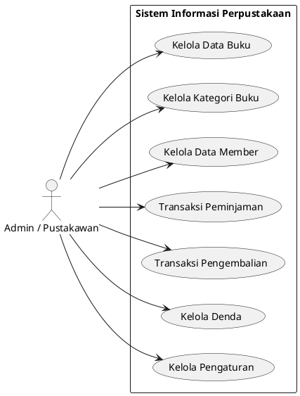
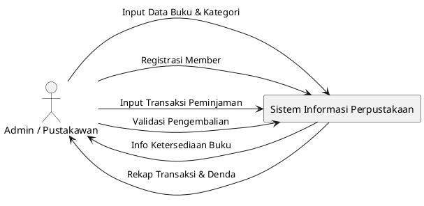
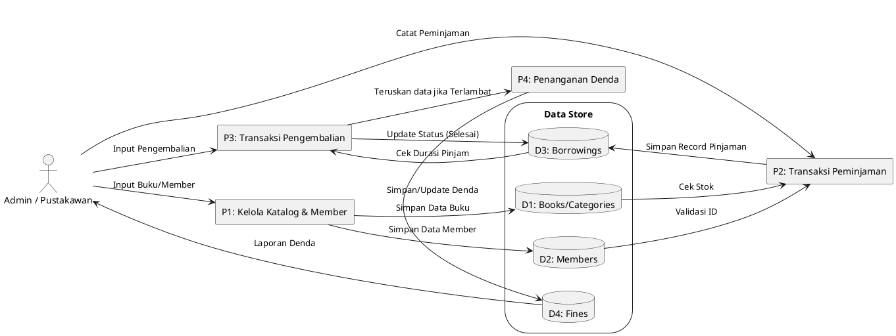
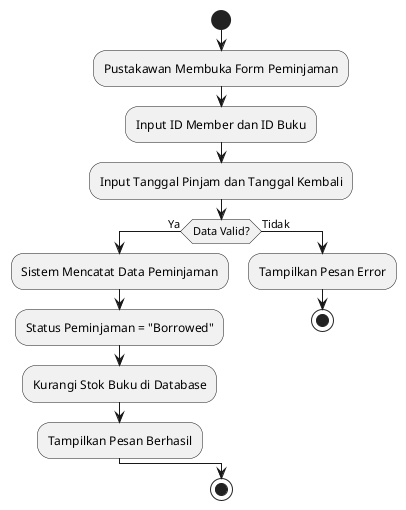
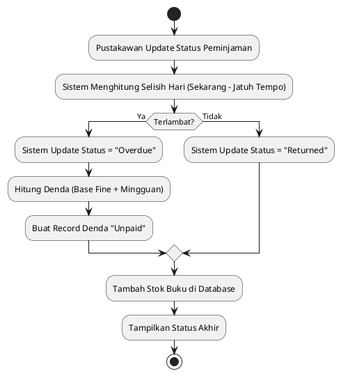

# Dokumentasi Desain Sistem Perpustakaan

Dokumen ini berisi rancangan teknis aplikasi perpustakaan, termasuk DFD, Activity Diagram, dan Use Case Diagram.

---

## 1. Use Case Diagram

Menunjukkan fungsi utama yang dapat dilakukan oleh pengguna (Pustakawan).

---

## 2. Data Flow Diagrams (DFD)

### DFD Level 0 (Context Diagram)

### DFD Level 1 (Overview Diagram)

---

## 3. Action Diagrams (Activity Diagrams)

### Activity Diagram: Peminjaman Buku

### Activity Diagram: Pengembalian & Penanganan Denda

